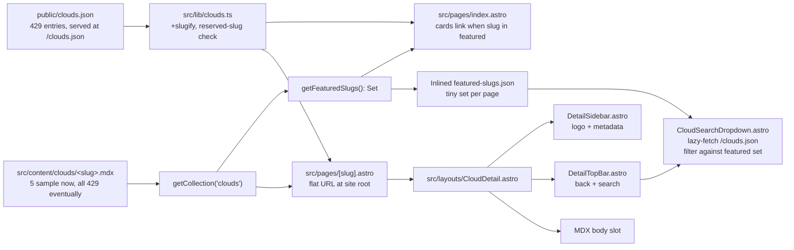

# Phase 2 — Per-Cloud Detail Pages

> Status: **Phase 2 — Implementation landed 2026-05-20** (5 sample MDX files)
> Branch: `feat/astro-migration`
> Tracks: [Issue #164](https://github.com/datum-cloud/awesome-alt-clouds/issues/164)
> RFC: [2026-05-19-astro-migration-rfc.md](./2026-05-19-astro-migration-rfc.md)

## Overview

Build per-cloud detail pages at flat URL `/<slug>` (e.g. `alt-cloud.org/neon`). Architecture targets eventual 100% MDX coverage of all clouds; this phase ships 5 sample MDX files. Search dropdown is performance-aware (lazy-fetched, cached `/clouds.json`), so it scales to 429+ entries without re-architecture.

## Source of truth correction

The canonical data file since Phase 1 is [public/clouds.json](../public/clouds.json). `docs/` is retired legacy. This plan uses `public/clouds.json` everywhere.

## Architecture



## Decisions locked

- **MDX scope (current)**: 5 sample MDX files. **Architecture scales to all 429** without code changes — only adding files.
- **Detail page = featured signal**: a cloud "has a detail page" iff `src/content/clouds/<slug>.mdx` exists. No `featured: true` field. As MDX coverage grows, more cards become clickable automatically.
- **URL shape**: flat — `https://alt-cloud.org/<slug>` (e.g. `/neon`, `/hetzner`). NOT `/clouds/<slug>`. Implemented via `src/pages/[slug].astro`.
- **Search strategy**: inline JS dropdown, performance-aware — see "Search performance" section. Shows all matching clouds; featured (has MDX) = anchor link, non-featured = `opacity-50 cursor-not-allowed aria-disabled`.
- **URL contract**: all Phase 1 URLs unchanged. Detail pages occupy the root namespace, so reserved slugs (`submit`, `clouds.json`, etc.) are blocked at build time.

## Detail page layout sketch

```
+-----------+----------------------------------------------+
| [LOGO]    |  [< Back to directory]   [Search clouds...]  |
| Cloud X   |  -----------------------------------------   |
|           |  # Cloud X                                   |
| 3/3 score |                                              |
| Category  |  <MDX body content — long-form>              |
| HQ        |                                              |
| Founded   |                                              |
| Regions   |                                              |
| Pricing   |                                              |
| Services  |                                              |
| Socials   |                                              |
| [Visit →] |                                              |
+-----------+----------------------------------------------+
```

Sidebar reuses existing tokens (`bg-cream`, `text-rich-earth`, `border-clay-beige`, `font-serif`) — no new colors. Top bar reuses the white rounded card pattern from [src/pages/index.astro](../src/pages/index.astro) (the current sort+search bar).

## Content Collection schema

[`src/content.config.ts`](../src/content.config.ts):

```typescript
import { defineCollection, z } from "astro:content";
import { glob } from "astro/loaders";

const clouds = defineCollection({
  loader: glob({ pattern: "**/*.mdx", base: "./src/content/clouds" }),
  schema: z.object({
    headquarters: z.string().optional(),
    foundedYear: z.number().int().optional(),
    regions: z.array(z.string()).optional(),
    services: z.array(z.string()).optional(),
    openSource: z.boolean().optional(),
    pricingModel: z
      .enum(["hourly", "monthly", "usage-based", "subscription", "mixed"])
      .optional(),
    socials: z
      .object({
        x: z.string().optional(),
        linkedin: z.string().optional(),
        github: z.string().optional(),
        website: z.string().optional(),
      })
      .optional(),
    logo: z.string().optional(),
    tagline: z.string().optional(),
  }),
});

export const collections = { clouds };
```

Entry IDs (file basenames) must `slugify` to a name present in `public/clouds.json` — enforced at build time.

## Hosting context (no server runtime)

GitHub Pages is a **static host** — it cannot run Astro's SSR mode (which requires a Node/Edge adapter). This plan uses Astro's default **static (SSG)** mode, same as Phase 1: everything is pre-rendered into HTML at build time inside the `deploy-pages.yml` GitHub Actions job, then `dist/` is uploaded as a Pages artifact. No request-time rendering happens on the server.

```
npm run build (GitHub Actions runner, build time)
  ├─ getStaticPaths() iterates MDX collection
  ├─ Render each slug → dist/<slug>/index.html
  └─ Bake featured-slugs JSON into each HTML
       ↓
actions/upload-pages-artifact → actions/deploy-pages
       ↓
GitHub Pages serves dist/<slug>/index.html as-is
       ↓
Browser parses inline JSON synchronously + runs dropdown JS
```

## Search performance (designed for 429+ items)

The search dropdown must work both for the 5 sample case AND for the eventual all-429-featured case without re-architecture. Key insight: `public/clouds.json` is already published as a static asset at `/clouds.json` (browser-cacheable, ~43KB gzipped).

Layered strategy:

1. **Inlined at build time**: per detail page, the Astro build embeds only the **featured slug set** as `<script type="application/json" id="featured-slugs">` directly into the rendered HTML — a tiny `string[]` (currently 5 entries × ~10 bytes ≈ 50 bytes, eventually 429 × ~10 bytes ≈ 4 KB). The browser parses it synchronously on first paint.
2. **Lazy-loaded on first interaction**: on `focus`/`input` of the search box, `fetch("/clouds.json")` once. Cache the parsed array in a module-level variable. Subsequent searches reuse it. Browser HTTP cache covers cross-page navigation.
3. **Filter algorithm**: simple `name.toLowerCase().includes(term)` over the cached array. For 429 entries this is sub-millisecond. No `MiniSearch`/`Fuse.js` overhead. Cap visible results to top 10.
4. **No duplication across pages**: detail pages do NOT each inline the full clouds array. Only the slug set. This keeps each detail page small and avoids 429 × 43KB byte duplication as coverage grows.

Trade-off accepted: first keystroke after page load triggers a one-time fetch (HTTP-cached after that). User perception: "Searching…" row for ~50 ms on cold cache, instant on warm cache.

## Files added

- [`src/content.config.ts`](../src/content.config.ts) — collection schema
- `src/content/clouds/<slug>.mdx` × 5 — seed files: Digital Ocean, Hetzner, Neon, Cloudflare, Render
- [`src/lib/profile.ts`](../src/lib/profile.ts) — `getFeaturedSlugs()`, `mergeCloudWithProfile()`
- [`src/pages/[slug].astro`](../src/pages/[slug].astro) — `getStaticPaths()` over the collection (flat URL)
- [`src/layouts/CloudDetail.astro`](../src/layouts/CloudDetail.astro) — sidebar + topbar + slot shell + prose styles
- [`src/components/DetailSidebar.astro`](../src/components/DetailSidebar.astro) — logo, name, score, categories, key facts, socials, visit CTA
- [`src/components/DetailTopBar.astro`](../src/components/DetailTopBar.astro) — back button + search slot
- [`src/components/CloudSearchDropdown.astro`](../src/components/CloudSearchDropdown.astro) — lazy-fetch JS dropdown
- [`src/components/ScoreBadge.astro`](../src/components/ScoreBadge.astro) — extracted score pill

## Files modified

- [`src/lib/clouds.ts`](../src/lib/clouds.ts) — added per-entry `slug`, `slugify()`, slug-collision check, reserved-slug check
- [`src/pages/index.astro`](../src/pages/index.astro) — wrap card name with `<a href="/<slug>">` when slug is featured; "Details →" affordance in footer
- [`package.json`](../package.json) — added `@astrojs/mdx`
- [`astro.config.mjs`](../astro.config.mjs) — registered `mdx()` integration
- [`analysis/2026-05-19-astro-migration-rfc.md`](./2026-05-19-astro-migration-rfc.md) — Phase 2 status row flipped

## Search dropdown component contract

- Input `<input>` + absolutely-positioned `<ul role="listbox">` dropdown
- On first `focus`: kick off `fetch("/clouds.json")`; on subsequent focuses, skip if cached
- On `input`: if data not yet loaded show "Searching…" row; else filter & render up to 10 matches
- Each `<li>`:
  - If `slug ∈ featuredSlugSet` → `<a href="/<slug>">{name} <span>Details →</span></a>`
  - Else → `<span aria-disabled="true" class="opacity-50 cursor-not-allowed">{name} <span>Listing only</span></span>`
- Keyboard: ArrowUp/Down navigate selectable items only (skip disabled), Enter follows link, Escape closes
- Click-outside closes

## Build-time invariants (fail loud)

1. Every MDX filename must `slugify` to a `clouds.json` entry name. Build error names the orphan slug.
2. Two `clouds.json` entries cannot slugify to the same string. Build error lists both names.
3. No `clouds.json` slug may collide with a **reserved root path**: `submit`, `clouds.json`, `llms.txt`, `llms-full.txt`, `og-image.png`, `altclouds-logo.png`, `robots.txt`, `404`, `rss.xml`, `sitemap-index.xml`, `cname`. Build error names the offender.
4. `astro check` + ESLint pass.

## Acceptance criteria

1. `npm run build` produces `dist/<slug>/index.html` for each MDX seed at site root.
2. `https://alt-cloud.org/<slug>` resolves for every featured cloud; static routes (`/submit/`, `/clouds.json`, `/llms*.txt`, `/og-image.png`) keep precedence over `/[slug]`.
3. Homepage `/` still renders all 429 cards; featured cards link to their detail page; non-featured cards visually unchanged.
4. Detail sidebar shows logo + metadata; topbar has Back + search dropdown.
5. Search dropdown lazy-loads `/clouds.json` on first interaction, filters all entries, links only featured results.
6. Build fails clearly when a reserved-slug collision or orphan MDX is introduced.
7. `npm run lint` clean.

## Path forward to 100% coverage

When the team eventually authors an MDX file for every cloud, **no code changes are needed**:

- `getFeaturedSlugs()` automatically picks them up
- Homepage `index.astro` automatically links every card
- Search dropdown automatically makes every result clickable
- Only the inlined `featured-slugs` JSON grows from ~50 bytes to ~4 KB per page

The MDX collection is the single switchboard. This is why we keep the "MDX presence = featured" rule simple.

## Out of scope (deferred)

- `JSON-LD Organization` schema per detail page → Phase 5 SEO polish
- Per-cloud OG image generation → Phase 5
- `/categories/<slug>` landing pages → Phase 4
- `/compare` stub → Phase 4
- Blog / RSS → Phase 3
