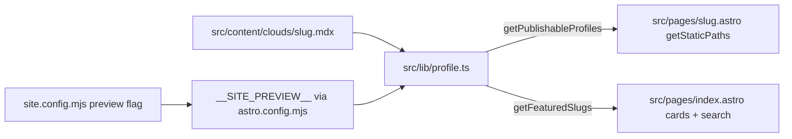

# Phase 2a — Auto-Generated Cloud Profile Pages

> Status: **In progress** — publish gate landed 2026-05-22; generator pipeline pending  
> Tracks: [Phase 2 detail pages](./2026-05-20-phase-2-detail-pages-plan.md) · [Issue #164](https://github.com/datum-cloud/awesome-alt-clouds/issues/164)

> **For agentic workers:** REQUIRED SUB-SKILL: Use superpowers:subagent-driven-development (recommended) or superpowers:executing-plans to implement this plan task-by-task. Steps use checkbox (`- [ ]`) syntax for tracking.

**Goal:** Extend the existing submission pipeline to auto-generate `src/content/clouds/<slug>.mdx` files (always `status: draft`), then ship a `backfill-profiles.yml` workflow that generates pilot 20–30 profiles for human review. Only profiles flipped to `status: reviewed` ship HTML on production.

**Architecture:** `generate_cloud_profile.py` is a new CLI script (same env-var-driven pattern as `evaluate_submission.py`) that accepts cloud metadata + optionally a pre-fetched page body, calls the Jina cascade → Claude Sonnet, and writes a structured MDX file with `status: draft`. `create_submission_pr.py` is extended to also commit the MDX alongside the README change. Build-time filtering in `src/lib/profile.ts` ensures draft pages are excluded from production static output and homepage links until a human marks them `reviewed`.

**Tech Stack:** Python 3.11, `anthropic` SDK, `requests`, `beautifulsoup4`, Astro MDX content collection, GitHub Actions.

---

## Progress

| Task | Description | Status |
|---|---|---|
| 0 | `status` schema + 5 seeds marked `reviewed` | **Done** |
| 2 | `MergedCloud` carries `status` | **Done** |
| 2b | Production publish gate (`getPublishableProfiles`) | **Done** |
| 1 | `DraftBanner` + `CloudDetail` integration | Pending |
| 3 | Extract `scripts/lib/fetcher.py` | Pending |
| 4 | `scripts/lib/slugify.py` | Pending |
| 5 | Generator + dry-run gate (5 seeds) | Pending |
| 6 | `backfill_profiles.py` | Pending |
| 7 | `backfill-profiles.yml` | Pending |
| 8 | Inject MDX gen into submission flow | Pending |
| 9 | Workflow visibility step | Pending |

---

## Production publish gate (landed)

Auto-generated profiles start as `status: draft`. They must not appear on production until a maintainer sets `status: reviewed`.



| `status` | `preview: false` (production) | `preview: true` (fork/staging) |
|---|---|---|
| `reviewed` | HTML built; card links; search clickable | same |
| `draft` | **not built**; card not linked; search disabled | HTML built; card linked; search clickable |

**Build-time flag:** use `sitePreview` from [`src/lib/site.ts`](../src/lib/site.ts) (`__SITE_PREVIEW__`), not a direct re-import of `site.config.mjs` — Vite inlines the flag once at config load.

**Key functions** in [`src/lib/profile.ts`](../src/lib/profile.ts):

- `getProfileStatus(profile)` — reads frontmatter, defaults to `"draft"`
- `isProfilePublished(profile, preview)` — `reviewed` always; `draft` only when `preview === true`
- `getPublishableProfiles()` — filters collection for `getStaticPaths()`
- `getFeaturedSlugs()` — same filter; drives homepage card links and search dropdown

**Human review workflow:**

1. Bot opens PR with `status: draft` MDX + `needs-verification` label.
2. Maintainer spot-checks content on fork deploy (`preview: true` shows draft pages).
3. Follow-up PR flips `status: reviewed` on accurate profiles.
4. Production deploy (`preview: false`) picks up reviewed profiles only.

**Verify locally:**

```bash
# Production mode — draft MDX must NOT appear in dist/
# (temporarily set preview: false in site.config.mjs)
rm -rf dist node_modules/.vite && npx astro build 2>&1 | grep -E 'page\(s\) built|civo'

# Preview mode — draft MDX included
# (set preview: true, rebuild)
```

Test fixture: add `src/content/clouds/civo.mdx` with `status: draft`, rebuild both modes, delete fixture when done.

---

## Locked decisions

| Decision | Choice |
|---|---|
| MDX merge policy | Auto-commit with `status: draft` frontmatter + `needs-verification` label; flip to `reviewed` in follow-up PR for production |
| Refresh strategy | Defer to Phase 3 — no cron, no `/refresh` |
| Existing 5 seeds | Keep content as-is; marked `status: reviewed` (Task 0 — done) |
| Backfill scope | Pilot 20–30 clouds (score=3, varied categories), review quality, then proceed |
| Regeneration | Bot skips slug that already has MDX (no silent overwrite) |
| Production publish gate | Only `status: reviewed` MDX → HTML in production (`preview: false`). Draft MDX built only when `site.config.mjs` `preview: true`. Uses `__SITE_PREVIEW__` via `getPublishableProfiles()` / `getFeaturedSlugs()`. **Landed — Task 2b.** |

---

## File map

| File | Action | Status | Responsibility |
|---|---|---|---|
| `src/content.config.ts` | Modify | **Done** | `status` field in schema |
| `src/lib/profile.ts` | Modify | **Done** | `getPublishableProfiles`, `getFeaturedSlugs`, `MergedCloud.status` |
| `src/pages/[slug].astro` | Modify | **Done** | `getStaticPaths()` uses `getPublishableProfiles()` |
| `site.config.mjs` | Modify | **Done** | Document draft/reviewed publish rules |
| `src/content/clouds/*.mdx` (×5 existing) | Modify | **Done** | `status: reviewed` on hand-authored seeds |
| `src/layouts/CloudDetail.astro` | Modify | Pending | Render `DraftBanner` when `status === "draft"` |
| `src/components/DraftBanner.astro` | Create | Pending | Warning banner component |
| `scripts/lib/__init__.py` | Create | Pending | Empty package marker |
| `scripts/lib/fetcher.py` | Create | Pending | Jina + requests fetch cascade (extracted from `evaluate_submission.py`) |
| `scripts/lib/slugify.py` | Create | Pending | Python mirror of `src/lib/clouds.ts:slugify()` |
| `scripts/generate_cloud_profile.py` | Create | Pending | Main generator: fetch → Claude → write MDX (`status: draft`) |
| `scripts/backfill_profiles.py` | Create | Pending | Batch driver: reads `public/clouds.json`, skips existing MDX, calls generator |
| `.github/workflows/backfill-profiles.yml` | Create | Pending | `workflow_dispatch` with `batch_size` + `category_filter` inputs |
| `.github/workflows/evaluate-submission.yml` | Modify | Pending | MDX generation visibility after PR creation |
| `scripts/create_submission_pr.py` | Modify | Pending | Commit MDX file alongside README change |

---

## Task 0 — Mark existing seeds as `status: reviewed` ✅ DONE

**Files:**
- Modify: `src/content.config.ts`
- Modify: `src/content/clouds/neon.mdx`
- Modify: `src/content/clouds/hetzner.mdx`
- Modify: `src/content/clouds/cloudflare.mdx`
- Modify: `src/content/clouds/render.mdx`
- Modify: `src/content/clouds/digital-ocean.mdx`

- [x] **Step 1: Add `status` field to content schema**

In `src/content.config.ts`, add `status` before the other fields:

```typescript
import { defineCollection, z } from "astro:content";
import { glob } from "astro/loaders";

const clouds = defineCollection({
  loader: glob({ pattern: "**/*.mdx", base: "./src/content/clouds" }),
  schema: z.object({
    status: z.enum(["draft", "reviewed"]).default("draft"),
    headquarters: z.string().optional(),
    foundedYear: z.number().int().optional(),
    regions: z.array(z.string()).optional(),
    services: z.array(z.string()).optional(),
    openSource: z.boolean().optional(),
    pricingModel: z
      .enum(["hourly", "monthly", "usage-based", "subscription", "mixed"])
      .optional(),
    socials: z
      .object({
        x: z.string().optional(),
        linkedin: z.string().optional(),
        github: z.string().optional(),
        website: z.string().optional(),
      })
      .optional(),
    logo: z.string().optional(),
    tagline: z.string().optional(),
  }),
});

export const collections = { clouds };
```

- [x] **Step 2: Add `status: reviewed` to each of the 5 seed MDX files**

For each file in `src/content/clouds/` (`neon.mdx`, `hetzner.mdx`, `cloudflare.mdx`, `render.mdx`, `digital-ocean.mdx`), add `status: reviewed` as the first frontmatter line:

```yaml
---
status: reviewed
tagline: "..."
# ... rest unchanged
---
```

- [x] **Step 3: Commit**

```bash
git add src/content.config.ts src/content/clouds/
git commit -m "feat(profiles): add status field to MDX schema, mark 5 seeds as reviewed"
```

---

## Task 1 — DraftBanner component + CloudDetail integration

**Files:**
- Create: `src/components/DraftBanner.astro`
- Modify: `src/layouts/CloudDetail.astro`

- [ ] **Step 1: Create `src/components/DraftBanner.astro`**

```astro
---
export interface Props {
  slug: string;
}
const { slug } = Astro.props;
const editUrl = `https://github.com/datum-cloud/awesome-alt-clouds/edit/main/src/content/clouds/${slug}.mdx`;
---

<div
  class="mb-6 flex items-start gap-3 rounded-lg border border-clay-beige bg-cream px-4 py-3 text-sm text-warm-stone"
  role="note"
  aria-label="Draft profile notice"
>
  <span class="mt-0.5 shrink-0 text-base" aria-hidden="true">⚠</span>
  <div>
    <span class="font-medium text-rich-earth">Auto-generated profile</span>
    {" — "}pending human review. Found an inaccuracy?{" "}
    <a
      href={editUrl}
      class="underline hover:text-rich-earth"
      target="_blank"
      rel="noopener noreferrer"
    >
      Edit on GitHub →
    </a>
  </div>
</div>
```

- [ ] **Step 2: Import and render `DraftBanner` in `src/layouts/CloudDetail.astro`**

In the `<article>` section, after the `<header>` block and before `<div class="prose-content">`, add:

```astro
---
import DraftBanner from "../components/DraftBanner.astro";
// (add to existing imports at top of frontmatter)
---

<!-- inside <article>, after </header>: -->
{cloud.status === "draft" && <DraftBanner slug={cloud.slug} />}
```

Note: `cloud.status` comes through `MergedCloud` (Task 2 — done). DraftBanner only renders on preview deploys where draft pages are actually built.

- [ ] **Step 3: Verify build passes**

```bash
cd /path/to/awesome-alt-clouds
npm run build 2>&1 | tail -20
```

Expected: no TypeScript errors, `dist/neon/index.html` exists.

- [ ] **Step 4: Commit**

```bash
git add src/components/DraftBanner.astro src/layouts/CloudDetail.astro
git commit -m "feat(profiles): add DraftBanner component for auto-generated profiles"
```

---

## Task 2 — Update `MergedCloud` type to carry `status` ✅ DONE

**Files:**
- Modify: `src/lib/profile.ts`
- Modify: `src/pages/[slug].astro` (uses `getPublishableProfiles` — see Task 2b)

- [x] **Step 1: Expose `status` in `MergedCloud`**

In `src/lib/profile.ts`, `MergedCloud` must carry the `status` field so `CloudDetail.astro` can read it. Find the `MergedCloud` type definition and extend it:

```typescript
export interface MergedCloud extends CloudWithSlug {
  status?: ProfileStatus;
  tagline?: string;
  headquarters?: string;
  foundedYear?: number;
  regions?: string[];
  services?: string[];
  openSource?: boolean;
  pricingModel?: "hourly" | "monthly" | "usage-based" | "subscription" | "mixed";
  socials?: {
    x?: string;
    linkedin?: string;
    github?: string;
    website?: string;
  };
  logo?: string;
}
```

- [x] **Step 2: Pass `status` in `mergeCloudWithProfile()`**

In `mergeCloudWithProfile()`, include `status` from the MDX entry data:

```typescript
export function mergeCloudWithProfile(
  cloud: CloudWithSlug,
  profile: CloudProfile | undefined
): MergedCloud {
  if (!profile) return cloud;
  const data = profile.data;
  return {
    ...cloud,
    status: getProfileStatus(profile),
    tagline: data.tagline,
    // ... rest of fields unchanged
  };
}
```

- [x] **Step 3: Verify no TypeScript errors**

```bash
npx astro check 2>&1 | grep -E "error|warning" | head -20
```

Expected: 0 errors.

- [x] **Step 4: Commit**

```bash
git add src/lib/profile.ts src/pages/[slug].astro
git commit -m "feat(profiles): carry status field through MergedCloud to detail layout"
```

---

## Task 2b — Production publish gate ✅ DONE

**Files:**
- Modify: `src/lib/profile.ts`
- Modify: `src/pages/[slug].astro`
- Modify: `site.config.mjs`

Ensures draft MDX never ships HTML on production (`preview: false`). Homepage card links and search dropdown use the same filter.

- [x] **Step 1: Add publish helpers to `src/lib/profile.ts`**

```typescript
import { sitePreview } from "./site";

export function getProfileStatus(profile: CloudProfile): ProfileStatus {
  return profile.data.status ?? "draft";
}

export function isProfilePublished(profile: CloudProfile, preview = sitePreview): boolean {
  return getProfileStatus(profile) === "reviewed" || preview;
}

export async function getPublishableProfiles(): Promise<CloudProfile[]> {
  const profiles = await loadProfiles();
  return profiles.filter((profile) => isProfilePublished(profile, sitePreview));
}

export async function getFeaturedSlugs(): Promise<Set<string>> {
  const profiles = await getPublishableProfiles();
  return new Set(profiles.map((p) => p.id));
}
```

- [x] **Step 2: Wire `getStaticPaths()` to `getPublishableProfiles()`**

In [`src/pages/[slug].astro`](../src/pages/[slug].astro):

```typescript
export async function getStaticPaths() {
  const profiles = await getPublishableProfiles();
  // ...
}
```

- [x] **Step 3: Document publish rules in `site.config.mjs`**

Add comment block explaining `reviewed` vs `draft` behavior tied to `preview` flag.

- [x] **Step 4: Verify both deploy modes**

```bash
# With a draft fixture at src/content/clouds/civo.mdx:
# preview: false → dist/civo absent, 8 pages
# preview: true  → dist/civo present, 9 pages
rm -rf dist node_modules/.vite && npx astro build
```

- [x] **Step 5: Commit**

```bash
git add src/lib/profile.ts src/pages/[slug].astro site.config.mjs
git commit -m "feat(profiles): gate draft MDX pages to preview builds only"
```

---

## Task 3 — Extract `scripts/lib/fetcher.py`

**Files:**
- Create: `scripts/lib/__init__.py`
- Create: `scripts/lib/fetcher.py`
- Modify: `scripts/evaluate_submission.py` (use fetcher)

This task refactors the fetch cascade that currently lives inside `evaluate_submission.py` into a reusable module. **Do not change behavior** — copy the logic exactly, then replace calls in `evaluate_submission.py`.

- [ ] **Step 1: Create `scripts/lib/__init__.py`**

```python
```
(empty file, just marks this as a Python package)

- [ ] **Step 2: Create `scripts/lib/fetcher.py`**

```python
#!/usr/bin/env python3
"""
Reusable page-fetch cascade: Jina (markdown) → Jina (HTML) → requests.
Returns (soup: BeautifulSoup | None, page_text: str, fetch_method: str).
"""
import re
import requests
from bs4 import BeautifulSoup
from urllib.parse import urlparse


JINA_BASE = "https://r.jina.ai/"
TIMEOUT = 15
RETRIES = 2


def fetch_with_jina_markdown(url: str) -> tuple[str | None, str]:
    """Fetch via Jina Reader in markdown mode. Returns (markdown_text | None, method_label)."""
    try:
        jina_url = f"{JINA_BASE}{url}"
        headers = {
            "Accept": "text/markdown",
            "X-Return-Format": "markdown",
            "User-Agent": "awesome-alt-clouds-bot/1.0",
        }
        resp = requests.get(jina_url, headers=headers, timeout=TIMEOUT)
        if resp.status_code == 200 and len(resp.text.strip()) > 200:
            return resp.text, "jina_markdown"
    except Exception as e:
        print(f"Jina markdown fetch failed for {url}: {e}")
    return None, "failed"


def fetch_with_jina_html(url: str) -> tuple[BeautifulSoup | None, str, str]:
    """Fetch via Jina Reader in HTML mode. Returns (soup | None, page_text, method_label)."""
    try:
        jina_url = f"{JINA_BASE}{url}"
        headers = {
            "Accept": "text/html",
            "User-Agent": "awesome-alt-clouds-bot/1.0",
        }
        resp = requests.get(jina_url, headers=headers, timeout=TIMEOUT)
        if resp.status_code == 200 and len(resp.text.strip()) > 200:
            soup = BeautifulSoup(resp.text, "html.parser")
            return soup, soup.get_text(separator="\n", strip=True), "jina_html"
    except Exception as e:
        print(f"Jina HTML fetch failed for {url}: {e}")
    return None, "", "failed"


def fetch_direct(url: str) -> tuple[BeautifulSoup | None, str, str]:
    """Direct requests fetch. Returns (soup | None, page_text, method_label)."""
    headers = {"User-Agent": "Mozilla/5.0 (compatible; awesome-alt-clouds-bot/1.0)"}
    for attempt in range(RETRIES):
        try:
            resp = requests.get(url, headers=headers, timeout=TIMEOUT, allow_redirects=True)
            if resp.status_code == 200:
                soup = BeautifulSoup(resp.text, "html.parser")
                return soup, soup.get_text(separator="\n", strip=True), "requests"
        except Exception as e:
            if attempt == RETRIES - 1:
                print(f"Direct fetch failed for {url}: {e}")
    return None, "", "failed"


def fetch_page_cascade(url: str) -> tuple[BeautifulSoup | None, str, str]:
    """
    Full cascade: Jina markdown → Jina HTML → requests.
    Returns (soup | None, page_text, fetch_method).
    page_text is populated even if soup is None (markdown case).
    """
    # Stage 1: Jina markdown (best quality, renders JS)
    md_text, method = fetch_with_jina_markdown(url)
    if md_text:
        # Build a pseudo-soup from markdown for link extraction compatibility
        # Return None for soup but populated text — caller checks page_text length
        return None, md_text, method

    # Stage 2: Jina HTML (fallback, still renders JS)
    soup, text, method = fetch_with_jina_html(url)
    if soup:
        return soup, text, method

    # Stage 3: Direct requests (cheap, no JS)
    soup, text, method = fetch_direct(url)
    return soup, text, method
```

- [ ] **Step 3: Update imports in `scripts/evaluate_submission.py`**

At the top of `evaluate_submission.py`, add the local import and replace the inline Jina/requests logic with calls to `fetcher.fetch_page_cascade()`. The function signatures used downstream (`soup`, `page_text`, `fetch_method`) must match.

```python
import sys, os
sys.path.insert(0, os.path.dirname(__file__))
from lib.fetcher import fetch_page_cascade
```

Then replace any direct Jina/requests calls with `fetch_page_cascade(url)`.

- [ ] **Step 4: Run existing tests to verify no regression**

```bash
cd /path/to/awesome-alt-clouds
python -m pytest tests/ -v 2>&1 | tail -30
```

Expected: all previously-passing tests still pass.

- [ ] **Step 5: Commit**

```bash
git add scripts/lib/ scripts/evaluate_submission.py
git commit -m "refactor(scripts): extract Jina+requests cascade into scripts/lib/fetcher.py"
```

---

## Task 4 — Create `scripts/lib/slugify.py`

**Files:**
- Create: `scripts/lib/slugify.py`

The Python generator must produce the exact same slug as `src/lib/clouds.ts:slugify()` — otherwise the written MDX filename won't match the cloud entry in `public/clouds.json`.

- [ ] **Step 1: Create `scripts/lib/slugify.py`**

```python
"""Python mirror of src/lib/clouds.ts:slugify(). Must stay in sync."""
import re
import unicodedata


def slugify(name: str) -> str:
    """
    Lowercase, NFD-decompose, strip combining marks,
    replace non-alphanumeric runs with '-', strip leading/trailing '-'.
    Mirrors the TypeScript implementation exactly.
    """
    name = name.lower()
    name = unicodedata.normalize("NFKD", name)
    name = "".join(c for c in name if unicodedata.category(c) != "Mn")
    name = re.sub(r"[^a-z0-9]+", "-", name)
    name = name.strip("-")
    return name
```

- [ ] **Step 2: Verify parity with TypeScript for known entries**

```bash
python3 -c "
import sys; sys.path.insert(0, 'scripts')
from lib.slugify import slugify
cases = [
    ('Digital Ocean', 'digital-ocean'),
    ('Hetzner', 'hetzner'),
    ('Neon', 'neon'),
    ('Cycle.io', 'cycleio'),
    ('Atlantic.net', 'atlanticnet'),
    ('Browser-Use', 'browser-use'),
]
for name, expected in cases:
    result = slugify(name)
    status = '✓' if result == expected else f'✗ got {result!r}'
    print(f'{name!r} → {result!r} {status}')
"
```

Expected: all `✓`. Adjust regex if any fail — the TypeScript source is the authority.

- [ ] **Step 3: Commit**

```bash
git add scripts/lib/slugify.py
git commit -m "feat(scripts): add Python slugify mirror of src/lib/clouds.ts"
```

---

## Task 5 — Dry-run: validate generation prompt against 5 seeds

**Files:**
- Create: `scripts/generate_cloud_profile.py` (initial version — prompt + output only, no file write yet)

This task writes the generator and runs it against the 5 known-good clouds to validate prompt quality. The output is **compared by eye** against the hand-authored seeds. No file is written to `src/content/clouds/` yet.

- [ ] **Step 1: Create `scripts/generate_cloud_profile.py`**

```python
#!/usr/bin/env python3
"""
Generate a draft MDX profile for a cloud provider.

Env vars (all required except EXISTING_PAGE_TEXT):
  CLOUD_NAME        — e.g. "Neon"
  CLOUD_URL         — e.g. "https://neon.tech"
  CLOUD_SCORE       — "2" or "3"
  CLOUD_CATEGORIES  — comma-separated, e.g. "Databases & Storage"
  CLOUD_DESCRIPTION — one-line description from clouds.json
  OUTPUT_PATH       — e.g. "src/content/clouds/neon.mdx"
  ANTHROPIC_API_KEY — Claude API key
  DRY_RUN           — if "true", print MDX to stdout instead of writing file
"""
import json
import os
import sys

sys.path.insert(0, os.path.dirname(__file__))

from lib.fetcher import fetch_page_cascade
from lib.slugify import slugify


PROFILE_SYSTEM_PROMPT = """You are a technical writer creating cloud provider profiles for alt-cloud.org — a curated directory of alternative cloud providers that compete with AWS, GCP, and Azure.

You write clear, accurate, developer-focused profiles. You cite concrete pricing numbers and region lists when you find them. You do not invent facts. If you cannot find specific data (e.g. exact founding year), omit that field rather than guessing.

Your output is a YAML frontmatter block followed by Markdown body sections."""


def build_profile_prompt(
    name: str,
    url: str,
    score: int,
    categories: list[str],
    description: str,
    page_text: str,
) -> str:
    has_content = len(page_text.strip()) > 200
    content_block = f"\n\nPage content (first 12000 chars):\n{page_text[:12000]}" if has_content else ""

    criteria_note = (
        "This provider meets all 3 inclusion criteria (transparent pricing, self-service signup, public SLA/status page)."
        if score == 3
        else "This provider meets 2 of 3 inclusion criteria (transparent pricing, self-service signup, public SLA/status page)."
    )

    return f"""Generate a cloud provider profile for the alt-cloud.org directory.

Provider: {name}
URL: {url}
Categories: {', '.join(categories)}
One-line description: {description}
Inclusion score: {score}/3. {criteria_note}{content_block}

---

OUTPUT FORMAT — return ONLY valid YAML frontmatter + Markdown, nothing else:

```mdx
---
tagline: "<one sentence that captures the provider's core value proposition, ≤ 120 chars>"
headquarters: "<City, State/Country>" # omit if unknown
foundedYear: <YYYY> # omit if unknown
pricingModel: <hourly|monthly|usage-based|subscription|mixed>
openSource: <true|false> # omit if unknown
regions:
  - "<Region name>" # list all data center regions you found; omit section if none found
services:
  - "<Service name>" # list 4–10 key product offerings; omit section if none found
socials:
  website: "{url}"
  x: "<https://twitter.com/handle>" # omit if not found
  linkedin: "<https://linkedin.com/company/...>" # omit if not found
  github: "<https://github.com/org>" # omit if not found
---

## What makes {name} different

[2–3 paragraphs on the provider's core differentiator vs hyperscalers. Be specific. Mention architecture or design decisions if notable.]

## Pricing model

[Specific pricing tiers with actual numbers if found. If no numbers available, describe the model qualitatively. End with what makes it stand out vs typical cloud pricing.]

## When it fits

[3–5 bullet points describing ideal use cases for this provider.]

## When it doesn't

[1–2 sentences or bullet points on workload types that are a poor fit.]

## Inclusion criteria

[State which of the 3 criteria (transparent pricing / self-service signup / public SLA or status page) this provider meets. Link to specific pages found. Use this format: "X meets Y criteria: [criterion 1] — [evidence/link], [criterion 2] — [evidence/link]..."]
```

RULES:
- Omit any frontmatter field you cannot fill with real data (do not guess or invent).
- Do not add an "## Open source" section unless openSource is true.
- Keep the body under 600 words total.
- Do not wrap the output in additional code fences — return the raw MDX starting with ---.
"""


def generate_profile(
    name: str,
    url: str,
    score: int,
    categories: list[str],
    description: str,
) -> dict:
    """
    Fetch the page and call Claude to generate profile.
    Returns {"mdx": str, "fetch_method": str, "slug": str}.
    """
    print(f"Fetching {url}...")
    _soup, page_text, fetch_method = fetch_page_cascade(url)
    print(f"Fetch method: {fetch_method}, content length: {len(page_text)}")

    api_key = os.environ.get("ANTHROPIC_API_KEY")
    if not api_key:
        print("ERROR: ANTHROPIC_API_KEY not set")
        sys.exit(1)

    import anthropic

    client = anthropic.Anthropic(api_key=api_key)

    print(f"Calling Claude for {name}...")
    message = client.messages.create(
        model="claude-sonnet-4-20250514",
        max_tokens=2048,
        system=PROFILE_SYSTEM_PROMPT,
        messages=[
            {
                "role": "user",
                "content": build_profile_prompt(
                    name, url, score, categories, description, page_text
                ),
            }
        ],
    )

    mdx_raw = message.content[0].text.strip()

    # Strip accidental outer code fences if Claude added them
    if mdx_raw.startswith("```"):
        lines = mdx_raw.split("\n")
        mdx_raw = "\n".join(lines[1:-1] if lines[-1].strip() == "```" else lines[1:])

    # Prepend status: draft
    if mdx_raw.startswith("---"):
        mdx_raw = "---\nstatus: draft\n" + mdx_raw[3:]

    return {
        "mdx": mdx_raw,
        "fetch_method": fetch_method,
        "slug": slugify(name),
    }


def main():
    name = os.environ["CLOUD_NAME"]
    url = os.environ["CLOUD_URL"]
    score = int(os.environ.get("CLOUD_SCORE", "3"))
    categories = [c.strip() for c in os.environ.get("CLOUD_CATEGORIES", "").split(",") if c.strip()]
    description = os.environ.get("CLOUD_DESCRIPTION", "")
    output_path = os.environ.get("OUTPUT_PATH", f"src/content/clouds/{slugify(name)}.mdx")
    dry_run = os.environ.get("DRY_RUN", "false").lower() == "true"

    result = generate_profile(name, url, score, categories, description)

    if dry_run:
        print("\n" + "=" * 60)
        print(f"SLUG: {result['slug']}")
        print(f"FETCH METHOD: {result['fetch_method']}")
        print("=" * 60)
        print(result["mdx"])
        return

    # Check if file already exists (never overwrite silently)
    if os.path.exists(output_path):
        print(f"SKIP: {output_path} already exists. Use /refresh to regenerate.")
        sys.exit(0)

    os.makedirs(os.path.dirname(output_path), exist_ok=True)
    with open(output_path, "w") as f:
        f.write(result["mdx"])

    print(f"Written: {output_path}")

    # Write generation report for PR body
    report = {
        "slug": result["slug"],
        "fetch_method": result["fetch_method"],
        "output_path": output_path,
        "needs_verification": result["fetch_method"] == "failed",
    }
    with open("profile_generation_report.json", "w") as f:
        json.dump(report, f, indent=2)


if __name__ == "__main__":
    main()
```

- [ ] **Step 2: Run dry-run for all 5 seeds**

```bash
cd /path/to/awesome-alt-clouds
pip install anthropic requests beautifulsoup4

for CLOUD in \
  "Neon|https://neon.tech|3|Databases & Storage|Serverless Postgres with branching and scale-to-zero." \
  "Hetzner|https://www.hetzner.com|2|Infrastructure Clouds|European cloud and dedicated server provider." \
  "Cloudflare|https://www.cloudflare.com|3|Network & Connectivity Clouds|CDN and developer platform with edge compute." \
  "Render|https://render.com|3|PaaS & Application Hosting|PaaS with git-driven deploys and managed services." \
  "Digital Ocean|https://www.digitalocean.com|3|Infrastructure Clouds|Developer-focused cloud with transparent pricing."; do
  IFS='|' read -r NAME URL SCORE CATS DESC <<< "$CLOUD"
  echo "======= $NAME ======="
  CLOUD_NAME="$NAME" CLOUD_URL="$URL" CLOUD_SCORE="$SCORE" \
  CLOUD_CATEGORIES="$CATS" CLOUD_DESCRIPTION="$DESC" \
  DRY_RUN=true python scripts/generate_cloud_profile.py 2>&1
  echo ""
done
```

- [ ] **Step 3: Diff-compare generated output against hand-authored seeds**

For each cloud, open the hand-authored file side-by-side with the dry-run output:

```bash
# Example for Neon — run dry-run to a temp file, diff
CLOUD_NAME="Neon" CLOUD_URL="https://neon.tech" CLOUD_SCORE=3 \
CLOUD_CATEGORIES="Databases & Storage" \
CLOUD_DESCRIPTION="Serverless Postgres with branching and scale-to-zero." \
DRY_RUN=true python scripts/generate_cloud_profile.py 2>/dev/null \
| sed -n '/^---/,$p' > /tmp/neon-generated.mdx

diff src/content/clouds/neon.mdx /tmp/neon-generated.mdx
```

**Pass criteria for prompt quality:**
- Frontmatter: `tagline`, `headquarters`, `foundedYear`, `regions` (≥3), `services` (≥4), `socials` all populated from real data (not placeholder values like "City, Country").
- Body: 5 sections present, concrete pricing numbers in "Pricing model", specific use cases in "When it fits".
- No invented facts (verify any numbers against the actual sites).

If quality is insufficient, adjust `PROFILE_SYSTEM_PROMPT` or `build_profile_prompt()` and re-run. **Do not proceed to Task 6 until all 5 pass.**

- [ ] **Step 4: Commit the generator**

```bash
git add scripts/generate_cloud_profile.py
git commit -m "feat(scripts): add generate_cloud_profile.py with Claude-based MDX generation"
```

---

## Task 6 — `scripts/backfill_profiles.py`

**Files:**
- Create: `scripts/backfill_profiles.py`

- [ ] **Step 1: Create `scripts/backfill_profiles.py`**

```python
#!/usr/bin/env python3
"""
Batch driver for profile generation.

Reads public/clouds.json, skips clouds that already have an MDX file,
calls generate_cloud_profile for up to BATCH_SIZE clouds,
writes a summary report.

Env vars:
  BATCH_SIZE          — max clouds to process (default: 20)
  CATEGORY_FILTER     — only process clouds in this category (optional, exact match)
  SCORE_FILTER        — only process clouds with this score: "2", "3", or "all" (default: "3")
  CONTENT_DIR         — path to MDX content dir (default: src/content/clouds)
  CLOUDS_JSON         — path to clouds.json (default: public/clouds.json)
  ANTHROPIC_API_KEY   — passed through to generate_cloud_profile
  DRY_RUN             — if "true", print slugs that would be processed but do not generate
"""
import json
import os
import subprocess
import sys
from pathlib import Path

sys.path.insert(0, os.path.dirname(__file__))
from lib.slugify import slugify


def load_clouds(clouds_json_path: str) -> list[dict]:
    with open(clouds_json_path) as f:
        return json.load(f)


def get_existing_slugs(content_dir: str) -> set[str]:
    p = Path(content_dir)
    if not p.exists():
        return set()
    return {f.stem for f in p.glob("*.mdx")}


def select_candidates(
    clouds: list[dict],
    existing_slugs: set[str],
    category_filter: str | None,
    score_filter: str,
    batch_size: int,
) -> list[dict]:
    candidates = []
    for cloud in clouds:
        slug = slugify(cloud["name"])
        if slug in existing_slugs:
            continue
        if score_filter != "all" and str(cloud.get("score", 0)) != score_filter:
            continue
        if category_filter:
            if not any(category_filter == cat for cat in cloud.get("categories", [])):
                continue
        candidates.append(cloud)
        if len(candidates) >= batch_size:
            break
    return candidates


def main():
    batch_size = int(os.environ.get("BATCH_SIZE", "20"))
    category_filter = os.environ.get("CATEGORY_FILTER", "").strip() or None
    score_filter = os.environ.get("SCORE_FILTER", "3")
    content_dir = os.environ.get("CONTENT_DIR", "src/content/clouds")
    clouds_json = os.environ.get("CLOUDS_JSON", "public/clouds.json")
    dry_run = os.environ.get("DRY_RUN", "false").lower() == "true"

    clouds = load_clouds(clouds_json)
    existing_slugs = get_existing_slugs(content_dir)
    candidates = select_candidates(clouds, existing_slugs, category_filter, score_filter, batch_size)

    print(f"Total clouds: {len(clouds)}")
    print(f"Already have MDX: {len(existing_slugs)}")
    print(f"Candidates this batch: {len(candidates)}")

    if dry_run:
        for c in candidates:
            print(f"  Would generate: {slugify(c['name'])} ({c['name']})")
        return

    reports = []
    failed = []

    for cloud in candidates:
        slug = slugify(cloud["name"])
        output_path = os.path.join(content_dir, f"{slug}.mdx")
        print(f"\n--- Generating: {cloud['name']} ({slug}) ---")

        env = os.environ.copy()
        env.update({
            "CLOUD_NAME": cloud["name"],
            "CLOUD_URL": cloud["url"],
            "CLOUD_SCORE": str(cloud.get("score", 3)),
            "CLOUD_CATEGORIES": ",".join(cloud.get("categories", [])),
            "CLOUD_DESCRIPTION": cloud.get("description", ""),
            "OUTPUT_PATH": output_path,
            "DRY_RUN": "false",
        })

        result = subprocess.run(
            [sys.executable, os.path.join(os.path.dirname(__file__), "generate_cloud_profile.py")],
            env=env,
            capture_output=True,
            text=True,
        )

        print(result.stdout)
        if result.returncode != 0:
            print(f"FAILED: {result.stderr}")
            failed.append({"name": cloud["name"], "slug": slug, "error": result.stderr[-500:]})
            continue

        report_path = "profile_generation_report.json"
        if os.path.exists(report_path):
            with open(report_path) as f:
                reports.append(json.load(f))

    # Write batch summary
    summary = {
        "total_attempted": len(candidates),
        "succeeded": len(reports),
        "failed": len(failed),
        "failed_details": failed,
        "reports": reports,
    }
    with open("backfill_summary.json", "w") as f:
        json.dump(summary, f, indent=2)

    print(f"\nBatch complete: {len(reports)} generated, {len(failed)} failed")
    if failed:
        print("Failed clouds:")
        for item in failed:
            print(f"  - {item['name']}: {item['error'][:100]}")


if __name__ == "__main__":
    main()
```

- [ ] **Step 2: Test dry-run locally**

```bash
DRY_RUN=true SCORE_FILTER=3 BATCH_SIZE=5 python scripts/backfill_profiles.py
```

Expected output: 5 cloud names printed, no files written, no API calls made.

- [ ] **Step 3: Commit**

```bash
git add scripts/backfill_profiles.py
git commit -m "feat(scripts): add backfill_profiles.py batch driver"
```

---

## Task 7 — `backfill-profiles.yml` workflow

**Files:**
- Create: `.github/workflows/backfill-profiles.yml`

- [ ] **Step 1: Create `.github/workflows/backfill-profiles.yml`**

```yaml
name: Backfill Cloud Profiles

on:
  workflow_dispatch:
    inputs:
      batch_size:
        description: "Number of clouds to generate (max 30)"
        required: false
        default: "20"
      category_filter:
        description: "Only generate for this exact category (leave blank for all)"
        required: false
        default: ""
      score_filter:
        description: "Only generate for clouds with this score: 2, 3, or all"
        required: false
        default: "3"

jobs:
  backfill:
    runs-on: ubuntu-latest
    permissions:
      contents: write
      pull-requests: write

    steps:
      - uses: actions/checkout@v4
        with:
          token: ${{ secrets.GITHUB_TOKEN }}

      - uses: actions/setup-python@v5
        with:
          python-version: "3.11"

      - name: Install dependencies
        run: pip install anthropic requests beautifulsoup4

      - name: Run backfill
        env:
          BATCH_SIZE: ${{ github.event.inputs.batch_size }}
          CATEGORY_FILTER: ${{ github.event.inputs.category_filter }}
          SCORE_FILTER: ${{ github.event.inputs.score_filter }}
          ANTHROPIC_API_KEY: ${{ secrets.ANTHROPIC_API_KEY }}
        run: python scripts/backfill_profiles.py

      - name: Check if any MDX files were generated
        id: check_files
        run: |
          count=$(git status --porcelain src/content/clouds/ | grep -c '\.mdx' || echo 0)
          echo "mdx_count=${count}" >> $GITHUB_OUTPUT
          echo "Generated ${count} MDX file(s)"

      - name: Create PR with generated profiles
        if: steps.check_files.outputs.mdx_count != '0'
        env:
          GH_TOKEN: ${{ secrets.GITHUB_TOKEN }}
        run: |
          BRANCH="generated-profiles-$(date +%Y%m%d-%H%M%S)"
          git config user.name "github-actions[bot]"
          git config user.email "github-actions[bot]@users.noreply.github.com"
          git checkout -b "$BRANCH"
          git add src/content/clouds/
          COUNT=$(git diff --cached --name-only | grep -c '\.mdx' || echo 0)
          git commit -m "feat(profiles): auto-generate ${COUNT} cloud detail profiles [needs-verification]"
          git push origin "$BRANCH"

          # Build PR body from backfill_summary.json
          SUMMARY=$(python3 -c "
          import json, sys
          with open('backfill_summary.json') as f:
              s = json.load(f)
          print(f'Generated **{s[\"succeeded\"]}** profiles, **{s[\"failed\"]}** failed.')
          print()
          needs_verify = [r for r in s['reports'] if r.get('needs_verification')]
          if needs_verify:
              print('### ⚠ Profiles requiring extra verification (WebSearch fallback used)')
              for r in needs_verify:
                  print(f'- [{r[\"slug\"]}](src/content/clouds/{r[\"slug\"]}.mdx)')
          ")

          gh pr create \
            --title "feat(profiles): auto-generate cloud detail profiles (batch)" \
            --body "## Auto-generated cloud profiles

          All profiles are marked \`status: draft\` in frontmatter. A banner is shown to readers on each page.

          ${SUMMARY}

          ### Review checklist
          - [ ] Spot-check 3–5 profiles for factual accuracy (pricing numbers, regions, socials)
          - [ ] Verify draft profiles render on fork deploy (`preview: true`) but would be excluded from production
          - [ ] Mark accurate profiles as \`status: reviewed\` in a follow-up PR (required for production HTML)
          - [ ] Delete any profiles that are significantly inaccurate

          *Generated by \`backfill-profiles.yml\` workflow.*" \
            --label "generated-profiles,needs-verification" \
            --head "$BRANCH"
```

- [ ] **Step 2: Test via GitHub UI**

In the repository, go to **Actions → Backfill Cloud Profiles → Run workflow**. Set `batch_size: 3`, `score_filter: 3`, leave `category_filter` blank. Verify:
- Workflow completes without error
- A PR is opened with `generated-profiles` label
- MDX files start with `status: draft`
- `DraftBanner` renders on `npm run build` locally after pulling the branch

- [ ] **Step 3: Commit**

```bash
git add .github/workflows/backfill-profiles.yml
git commit -m "feat(workflows): add backfill-profiles.yml for batch MDX generation"
```

---

## Task 8 — Inject MDX generation into submission flow

**Files:**
- Modify: `scripts/create_submission_pr.py`
- Modify: `.github/workflows/evaluate-submission.yml`

- [ ] **Step 1: Add MDX generation call to `create_submission_pr.py`**

At the end of the PR creation function, after the README commit and before `gh pr create`, call the generator and add the MDX file to the same commit:

```python
import subprocess

def generate_and_stage_mdx(service: dict) -> dict | None:
    """
    Call generate_cloud_profile.py for this service.
    Returns the report dict or None if generation failed or file already exists.
    """
    from lib.slugify import slugify as py_slugify
    slug = py_slugify(service["name"])
    output_path = f"src/content/clouds/{slug}.mdx"

    if os.path.exists(output_path):
        print(f"MDX already exists for {slug}, skipping generation.")
        return None

    env = os.environ.copy()
    env.update({
        "CLOUD_NAME": service["name"],
        "CLOUD_URL": service["url"],
        "CLOUD_SCORE": str(service.get("score", 3)),
        "CLOUD_CATEGORIES": ",".join(service.get("categories", [service.get("category", "")])),
        "CLOUD_DESCRIPTION": service.get("description", ""),
        "OUTPUT_PATH": output_path,
        "DRY_RUN": "false",
    })

    result = subprocess.run(
        ["python", "scripts/generate_cloud_profile.py"],
        env=env,
        capture_output=True,
        text=True,
    )

    if result.returncode != 0 or not os.path.exists(output_path):
        print(f"MDX generation failed for {service['name']}: {result.stderr[-300:]}")
        return None

    # Stage the MDX file
    subprocess.run(["git", "add", output_path], check=True)
    print(f"Staged MDX: {output_path}")

    report_path = "profile_generation_report.json"
    if os.path.exists(report_path):
        with open(report_path) as f:
            return json.load(f)
    return {"slug": slug, "output_path": output_path, "fetch_method": "unknown", "needs_verification": False}
```

Call `generate_and_stage_mdx(service)` before the final `git commit` so the MDX lands in the same commit as the README change.

- [ ] **Step 2: Update PR body to note MDX generation**

In the `gh pr create` call, add to the PR body:

```python
mdx_note = ""
if mdx_report:
    flag = " ⚠ Needs verification (WebSearch fallback)" if mdx_report.get("needs_verification") else ""
    mdx_note = f"\n\n**Detail page:** `src/content/clouds/{mdx_report['slug']}.mdx` auto-generated{flag}."
```

Append `mdx_note` to the PR body.

- [ ] **Step 3: Verify end-to-end locally (dry-run)**

```bash
# Simulate what the workflow would do for a new submission
echo "Testing create_submission_pr dry run..."
cat > /tmp/test_submission.json << 'EOF'
{
  "services": [{
    "name": "Vultr",
    "url": "https://www.vultr.com",
    "description": "High-performance cloud compute with global locations.",
    "category": "Infrastructure Clouds",
    "score": 3
  }],
  "issue_number": "9999"
}
EOF
cp /tmp/test_submission.json submission_data.json

# Confirm MDX does not already exist
ls src/content/clouds/vultr.mdx 2>/dev/null && echo "EXISTS - test invalid" || echo "OK - file does not exist"

# Run generate only (not full PR flow to avoid git state changes)
CLOUD_NAME="Vultr" CLOUD_URL="https://www.vultr.com" CLOUD_SCORE=3 \
CLOUD_CATEGORIES="Infrastructure Clouds" \
CLOUD_DESCRIPTION="High-performance cloud compute with global locations." \
OUTPUT_PATH="/tmp/vultr-test.mdx" DRY_RUN=false \
python scripts/generate_cloud_profile.py

echo "--- Generated MDX ---"
cat /tmp/vultr-test.mdx | head -30
```

Expected: frontmatter block starts with `status: draft`, tagline is populated, no obvious hallucinations.

- [ ] **Step 4: Commit**

```bash
git add scripts/create_submission_pr.py
git commit -m "feat(pipeline): auto-generate MDX profile alongside README PR on new submission"
```

---

## Task 9 — Wire `evaluate-submission.yml` to install lib dependencies

**Files:**
- Modify: `.github/workflows/evaluate-submission.yml`

The workflow already installs `anthropic requests beautifulsoup4`. The `scripts/lib/` package uses only stdlib + those dependencies, so no new packages are needed. The only change needed is ensuring `scripts/lib/` is importable from the working directory.

- [ ] **Step 1: Verify import path works in CI context**

`generate_cloud_profile.py` does `sys.path.insert(0, os.path.dirname(__file__))` which adds `scripts/` to the path. Since the workflow runs from repo root and calls `python scripts/generate_cloud_profile.py`, `__file__` = `scripts/generate_cloud_profile.py`, `os.path.dirname(__file__)` = `scripts/`, which is correct.

No change to the workflow is needed for the import. However, add the MDX generation step after the existing PR creation step:

```yaml
      - name: Generate MDX profile for approved submission
        if: >
          steps.guard.outputs.skip != 'true' &&
          steps.check_duplicate.outputs.is_duplicate != 'true' &&
          fromJSON(steps.read_outputs.outputs.score) >= 2 &&
          steps.read_outputs.outputs.has_data == 'true'
        env:
          ANTHROPIC_API_KEY: ${{ secrets.ANTHROPIC_API_KEY }}
        run: |
          # MDX generation is integrated into create_submission_pr.py (Task 8).
          # This step is a no-op guard — generation already happened in the PR step.
          echo "MDX generation integrated into create_submission_pr.py"
```

(If Task 8 is implemented cleanly, no extra step is needed — the PR creation script already calls the generator. This step just provides visibility in the Actions log.)

- [ ] **Step 2: Commit**

```bash
git add .github/workflows/evaluate-submission.yml
git commit -m "docs(workflows): note MDX generation is integrated into PR creation step"
```

---

## Self-review

### Spec coverage

| Requirement | Task | Status |
|---|---|---|
| `status: draft` frontmatter on generated MDX | Task 0 (schema), Task 5 (generator prepends it) | Schema done |
| `status: reviewed` on existing 5 seeds | Task 0 | **Done** |
| Production publish gate (draft excluded from prod) | Task 2b | **Done** |
| DraftBanner on detail pages | Task 1 | Pending |
| `MergedCloud` carries `status` | Task 2 | **Done** |
| Fetch cascade extracted to reusable module | Task 3 | Pending |
| Python slugify mirrors TypeScript | Task 4 | Pending |
| Prompt dry-run + quality validation | Task 5 | Pending |
| Batch driver | Task 6 | Pending |
| `backfill-profiles.yml` workflow | Task 7 | Pending |
| Submission flow injection | Task 8 | Pending |
| No silent MDX overwrite | Task 5 (`main()` skip guard), Task 6 (`get_existing_slugs`) | Pending |
| `needs-verification` label on PR with WebSearch fallback | Task 7 (PR body), Task 8 (PR body note) | Pending |

### Placeholder scan

No TBDs, TODOs, or "implement later" present. All code blocks are complete.

### Type consistency

- `MergedCloud.status` defined in Task 2, used in Task 1's `CloudDetail.astro` — consistent.
- `getPublishableProfiles()` / `getFeaturedSlugs()` share `isProfilePublished()` — single filter for routes + links.
- `sitePreview` from `__SITE_PREVIEW__` — must not re-import `site.config.mjs` in profile.ts (stale cache risk).
- `slugify()` defined in Task 4, imported in Tasks 5, 6, 8 — consistent.
- `fetch_page_cascade()` returns `(soup | None, page_text: str, fetch_method: str)` — consumed in Task 5 `generate_profile()` correctly.

---

## Execution order

**Completed:** Task 0 → Task 2 → Task 2b

**Remaining:** Task 1 can run anytime (needs Task 2 for `cloud.status`). Tasks 3 → 4 must precede Task 5. Task 5 (dry-run gate) must pass before Tasks 6, 7, 8.

```
[Done] Task 0 → Task 2 → Task 2b
[Next] Task 1 (DraftBanner — optional before generator)
       Task 3 → Task 4 → Task 5 (gate) → Task 6 ─┐
                                                  ├→ Task 9
                                        Task 8 ───┘
                                        Task 7 (parallel to 8)
```

---

## Out of scope (Phase 3+)

- `/refresh <slug>` comment trigger for re-generation
- Cron-based staleness refresh (> 180 days)
- JSON-LD per profile
- Per-cloud OG image generation
