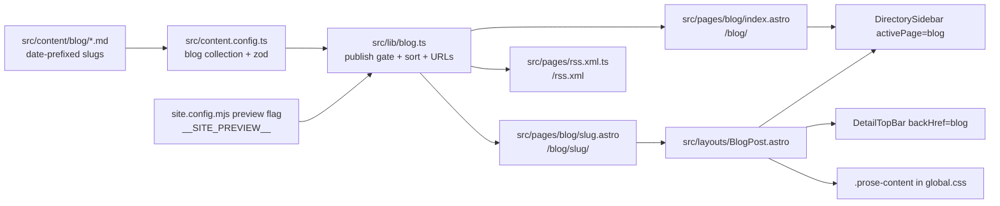
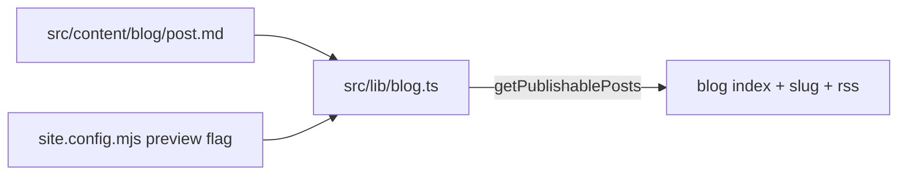

# Phase 3 — Editorial Blog + RSS

> Status: **Phase 3 — Implementation landed 2026-06-15**
> Branch: `feat/astro-migration`
> Tracks: [Issue #164](https://github.com/datum-cloud/awesome-alt-clouds/issues/164) Idea 2
> RFC: [2026-05-19-astro-migration-rfc.md](./2026-05-19-astro-migration-rfc.md)

## Overview

Ship an in-repo editorial blog at `/blog/` so the site can publish short-form content (trends, new entrants, commentary) without duplicating `README.md` as the listings source of truth. Posts are Markdown files under `src/content/blog/` with zod-validated frontmatter, PR-reviewed before merge, and gated by a `draft` flag that mirrors the cloud profile `status: draft` publish pattern from Phase 2a.

UI reuses existing site chrome — no new design tokens. Blog index mirrors `/watchlist/`; post pages mirror `/<slug>/` cloud detail layout.

## Two blog systems (coexist)

| System | Files | Output | Status |
|---|---|---|---|
| **Astro in-repo blog** | `src/content/blog/*.md` | `/blog/`, `/blog/<slug>/`, `/rss.xml` | **Phase 3 — live** |
| **Legacy Datum scraper** | `scripts/update_blog_posts.mjs` | Patches Resources modal in `docs/index.html` | **Kept** — independent until Phase 6 retires `docs/` |

Decision (2026-06-15): do **not** retire `update_blog_posts.mjs` or `.github/workflows/update-blog-posts.yml`. The scraper and the Astro blog serve different surfaces.

## Architecture



## Decisions locked

| Decision | Choice |
|---|---|
| Content source | Hand-authored Markdown in `src/content/blog/` — PR-only, no bot generation at launch |
| Slug convention | Filename without extension, date-prefixed: `YYYY-MM-short-slug.md` → `/blog/YYYY-MM-short-slug/` |
| Publish gate | `draft: false` → production + preview; `draft: true` → preview deploys only (`preview: true` in `site.config.mjs`) |
| Layout | Reuse `DirectorySidebar` + `DetailTopBar` + `.prose-content` — match `/watchlist/` and `/<slug>/` |
| Nav placement | Third sidebar item (Directory / Watchlist / **Blog**); also in homepage inline sidebar + mobile drawer |
| RSS | `@astrojs/rss` at `/rss.xml`; auto-discovery `<link rel="alternate">` in `Base.astro` |
| Legacy scraper | **Keep** `update_blog_posts.mjs` + `update-blog-posts.yml` (Datum → `docs/index.html`) |
| Reserved slug | `"blog"` added to `RESERVED_SLUGS` in `src/lib/clouds.ts` |

## Content collection schema

[`src/content.config.ts`](../src/content.config.ts):

```typescript
const blog = defineCollection({
  loader: glob({ pattern: "**/*.{md,mdx}", base: "./src/content/blog" }),
  schema: z.object({
    title: z.string(),
    description: z.string(),
    publishDate: z.coerce.date(),
    updatedDate: z.coerce.date().optional(),
    author: z.string(),
    tags: z.array(z.string()).default([]),
    draft: z.boolean().default(false),
    heroImage: z.string().optional(),
  }),
});
```

Entry `id` is the filename stem (e.g. `2026-06-welcome-to-alt-cloud` from `2026-06-welcome-to-alt-cloud.md`).

## Publish gate

Same pattern as Phase 2a profile `status: draft`:



| `draft` | `preview: false` (production) | `preview: true` (fork/staging) |
|---|---|---|
| `false` | Built; in RSS; listed on `/blog/` | same |
| `true` | **not built**; excluded from RSS | Built; shows draft banner on post page |

**Key functions** in [`src/lib/blog.ts`](../src/lib/blog.ts):

- `isPostPublished(post, preview)` — `!draft` always; `draft` only when `preview === true`
- `getPublishablePosts()` — filters collection for pages + RSS
- `sortedByDate(posts)` — newest `publishDate` first
- `postUrl(slug)` — base-path-aware link via `asset()`
- `formatPostDate(date)` — display formatting (UTC)

Build-time flag: `sitePreview` from [`src/lib/site.ts`](../src/lib/site.ts) (`__SITE_PREVIEW__`), not a runtime re-import of `site.config.mjs`.

## Routes & pages

| Route | File | Notes |
|---|---|---|
| `/blog/` | [`src/pages/blog/index.astro`](../src/pages/blog/index.astro) | Post list, newest first; stats cards; RSS link |
| `/blog/<slug>/` | [`src/pages/blog/[slug].astro`](../src/pages/blog/[slug].astro) | `getStaticPaths()` over `getPublishablePosts()` |
| `/rss.xml` | [`src/pages/rss.xml.ts`](../src/pages/rss.xml.ts) | `@astrojs/rss`; non-draft posts only |

## Layout & components

### Blog index (`/blog/`)

Mirrors [`src/pages/watchlist/index.astro`](../src/pages/watchlist/index.astro):

```
+-----------+----------------------------------------------+
| [LOGO]    |  [< Back to directory]   [Search clouds...]  |
| Directory |  -----------------------------------------   |
| Watchlist |  # Blog                                      |
| **Blog**  |  Short-form notes on alt clouds...           |
|           |  [Published: N posts]  [Feed: RSS]           |
|           |  +----------------------------------------+  |
|           |  | 2026-06-10 · Datum                     |  |
|           |  | What Is an Alt Cloud?                  |  |
|           |  | One-sentence description...            |  |
|           |  +----------------------------------------+  |
+-----------+----------------------------------------------+
```

Post cards: `bg-white border border-clay-beige rounded-xl p-5 hover:border-soft-sage`.

### Blog post (`/blog/<slug>/`)

[`src/layouts/BlogPost.astro`](../src/layouts/BlogPost.astro) mirrors [`src/layouts/CloudDetail.astro`](../src/layouts/CloudDetail.astro):

- `DirectorySidebar activePage="blog"`
- `DetailTopBar` with `backHref` → `/blog/`, `backLabel="Back to blog"`
- Article header: date · author · tags; serif H1; description
- Draft banner when `draft: true` on preview deploys
- Body in `<div class="prose-content">`

### Navigation additions

| Component | Change |
|---|---|
| [`DirectorySidebar.astro`](../src/components/DirectorySidebar.astro) | `activePage` union extended: `"directory" \| "watchlist" \| "blog"`; third nav link |
| [`BlogNavLink.astro`](../src/components/BlogNavLink.astro) | Homepage sidebar + mobile drawer link (matches `WatchlistNavLink` pattern) |
| [`DetailTopBar.astro`](../src/components/DetailTopBar.astro) | Optional `backHref` / `backLabel` props (defaults: directory) |
| [`src/pages/index.astro`](../src/pages/index.astro) | `<BlogNavLink />` in desktop sidebar footer + mobile drawer |

### Shared prose styles

`.prose-content` moved from `CloudDetail.astro` scoped styles into [`src/styles/global.css`](../src/styles/global.css) so cloud detail pages and blog posts share one typography source.

## SEO & metadata

| Concern | Implementation |
|---|---|
| Blog index title/description | `seo.blog` in [`site.config.mjs`](../site.config.mjs); `getPageMeta("blog")` in [`src/lib/site-meta.ts`](../src/lib/site-meta.ts) |
| Per-post title | `{title} \| Awesome Alt Clouds` |
| Per-post canonical | `absoluteUrl("blog/{slug}")` |
| Per-post OG | `og:type=article`; optional `heroImage` from frontmatter |
| JSON-LD | `BlogPosting` schema injected via `<Fragment slot="head">` in `BlogPost.astro` |
| RSS discovery | `<link rel="alternate" type="application/rss+xml">` in [`Base.astro`](../src/layouts/Base.astro) |
| `head` slot | `Base.astro` exposes `<slot name="head" />` for per-page meta/JSON-LD |

## Editorial workflow

1. Contributor forks, adds `src/content/blog/YYYY-MM-slug.md` with required frontmatter.
2. Optional: set `draft: true` for preview-only review.
3. Open PR; maintainer reviews content (same human gate as profile MDX).
4. Merge → `deploy-pages.yml` rebuilds; new post appears on next deploy.
5. Flip `draft: false` (or omit — default is published) before merge for production visibility.

Authoring spec: [`CONTRIBUTING.md`](../CONTRIBUTING.md) §3.

## Seed posts

| File | Title | `publishDate` |
|---|---|---|
| `2026-06-welcome-to-alt-cloud.md` | Welcome to the Alt Cloud Blog | 2026-06-01 |
| `2026-06-what-is-an-alt-cloud.md` | What Is an Alt Cloud? | 2026-06-10 |

Both `draft: false`, `author: Datum`.

## Dependencies

| Package | Purpose |
|---|---|
| `@astrojs/rss` | `/rss.xml` endpoint |
| `@astrojs/mdx` | Already installed; blog uses `.md` for MVP (`.mdx` supported by loader) |

## Legacy Datum scraper (kept)

[`scripts/update_blog_posts.mjs`](../scripts/update_blog_posts.mjs) fetches Zac Smith articles from Datum Strapi and patches the Resources modal in legacy [`docs/index.html`](../docs/index.html).

[`.github/workflows/update-blog-posts.yml`](../.github/workflows/update-blog-posts.yml) runs daily at 06:00 UTC (plus `workflow_dispatch`), opens/refreshes PR `automation/update-blog-posts`.

This is **independent** of the Astro blog. Both can run until Phase 6 cutover retires `docs/`.

## Verification

```bash
npm run build
# Expect: dist/blog/index.html
#         dist/blog/2026-06-welcome-to-alt-cloud/index.html
#         dist/blog/2026-06-what-is-an-alt-cloud/index.html
#         dist/rss.xml

# Draft gating (toggle preview in site.config.mjs):
# preview: false → draft posts absent from dist/blog/
# preview: true  → draft posts present with draft banner
```

Build result (2026-06-15): **408 pages** including blog routes and RSS.

## Files added / changed

| Path | Role |
|---|---|
| `src/content.config.ts` | `blog` collection schema |
| `src/lib/blog.ts` | Publish gate, sort, URL helpers |
| `src/lib/clouds.ts` | `"blog"` in `RESERVED_SLUGS` |
| `src/lib/site-meta.ts` | `getPageMeta("blog")`, `blogTitle`, `blogDescription` |
| `src/styles/global.css` | `.prose-content` (extracted from CloudDetail) |
| `src/layouts/BlogPost.astro` | Post page layout |
| `src/layouts/Base.astro` | RSS `<link>`, `head` slot |
| `src/layouts/CloudDetail.astro` | Prose styles removed (now global) |
| `src/components/DirectorySidebar.astro` | Blog nav item |
| `src/components/BlogNavLink.astro` | Homepage blog link |
| `src/components/DetailTopBar.astro` | `backHref` / `backLabel` props |
| `src/pages/blog/index.astro` | Blog index |
| `src/pages/blog/[slug].astro` | Blog post pages |
| `src/pages/rss.xml.ts` | RSS feed |
| `src/pages/index.astro` | Blog nav in sidebar + drawer |
| `src/content/blog/*.md` | Seed posts |
| `site.config.mjs` | `seo.blog` block |
| `CONTRIBUTING.md` | §3 blog authoring + legacy scraper note |
| `package.json` | `@astrojs/rss` dependency |

## Out of scope (deferred)

- Homepage "Latest from the blog" strip (1–3 recent posts)
- Tag landing pages (`/blog/tags/<tag>/`)
- Automated external RSS/HTML ingest into `src/content/blog/` (RFC Option B)
- Per-post OG image generation (Phase 5+ — still TBD)
- ~~Sitemap coverage for blog routes~~ → ✅ Phase 5 (`@astrojs/sitemap`; [2026-06-16-phase-5-seo-plan.md](./2026-06-16-phase-5-seo-plan.md))
- Retiring `update_blog_posts.mjs` (explicitly kept per 2026-06-15 decision)

## Related docs

- [2026-05-19-astro-migration-rfc.md](./2026-05-19-astro-migration-rfc.md) — master migration RFC; Phase 3 row + acceptance criteria
- [2026-06-16-phase-5-seo-plan.md](./2026-06-16-phase-5-seo-plan.md) — sitemap + robots.txt (covers blog routes)
- [2026-05-22-phase-2a-auto-profile-generation-plan.md](./2026-05-22-phase-2a-auto-profile-generation-plan.md) — publish gate pattern this phase mirrors
- [CONTRIBUTING.md](../CONTRIBUTING.md) — contributor-facing authoring guide
