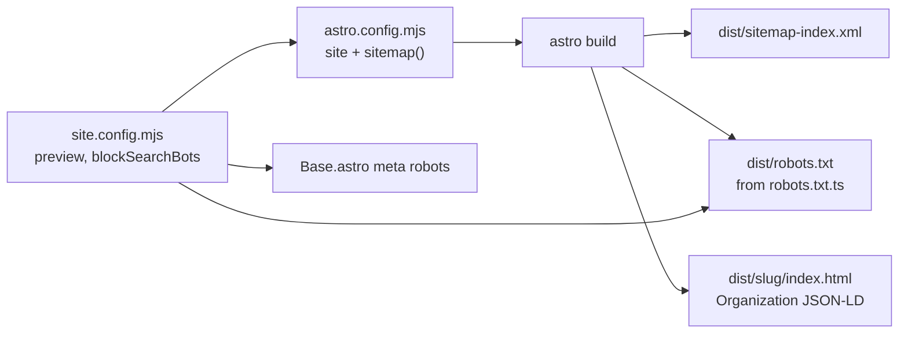

# Phase 5 — SEO Polish

> Status: **Phase 5 — Implementation landed 2026-06-16**
> Branch: `feat/astro-migration`
> Tracks: [Issue #164](https://github.com/datum-cloud/awesome-alt-clouds/issues/164) Idea 5
> RFC: [2026-05-19-astro-migration-rfc.md](./2026-05-19-astro-migration-rfc.md)

## Overview

Close the SEO gaps left after Phases 1–3: sitemap generation for all static routes, build-time `robots.txt` tied to the preview/production deploy profile, and per-profile `Organization` JSON-LD on cloud detail pages. No new UI routes — only build-time artifacts and `<head>` enrichment.

Shipped ahead of Phase 4 (category landings + compare) because it has no UX surface. **Phase 4 landed 2026-06-30** — see [2026-06-30-phase-4-discovery-plan.md](./2026-06-30-phase-4-discovery-plan.md).

## Acceptance criteria (RFC §9)

| Criterion | Status |
|---|---|
| Per-page `Organization` JSON-LD on profile pages | ✅ `CloudDetail.astro` |
| `BlogPosting` JSON-LD on blog posts | ✅ Already in Phase 3 (`BlogPost.astro`) |
| `@astrojs/sitemap` covers all built routes | ✅ `sitemap-index.xml` + `sitemap-0.xml` |
| Per-page OG images | ⏳ Out of MVP (RFC line 577) |

## Architecture



## Decisions locked

| Decision | Choice |
|---|---|
| Sitemap integration | `@astrojs/sitemap` in `astro.config.mjs`; no custom filter — draft profiles/posts already excluded from static build by publish gates |
| `robots.txt` source | Build-time Astro endpoint `src/pages/robots.txt.ts` (same pattern as `rss.xml.ts`), **not** a hand-edited `public/robots.txt` |
| Preview crawl blocking | When `blockSearchBots: true`: `robots.txt` → `Disallow: /` + meta robots noindex in `Base.astro` |
| Production cutover | Flip `preview: false` in `site.config.mjs` → sitemap URLs switch to `www.alt-cloud.org`; `robots.txt` emits `Allow: /` + `Sitemap:` line automatically |
| Profile JSON-LD | `@graph` with `Organization` (the cloud provider) + `WebPage` (the profile page); injected via `<Fragment slot="head">` in `CloudDetail.astro` |
| Reserved slug | `"robots.txt"` already in `RESERVED_SLUGS` (`src/lib/clouds.ts`) |

## Files changed

| File | Role |
|---|---|
| `package.json` | `@astrojs/sitemap` dependency |
| `astro.config.mjs` | `sitemap()` integration |
| `src/pages/robots.txt.ts` | Build-time endpoint → static `dist/robots.txt` |
| `src/layouts/CloudDetail.astro` | Per-profile `Organization` + `WebPage` JSON-LD |

## Profile JSON-LD fields

Drawn from `MergedCloud` (README base + MDX frontmatter overlay):

| Schema field | Source |
|---|---|
| `Organization.name` | `cloud.name` |
| `Organization.url` | `cloud.url` (provider website) |
| `Organization.description` | `cloud.tagline ?? cloud.description` |
| `Organization.logo` | `cloud.logo` when present |
| `Organization.sameAs` | `cloud.socials.{website,x,linkedin,github}` (compact) |
| `Organization.address.addressLocality` | `cloud.headquarters` when present |
| `Organization.foundingDate` | `String(cloud.foundedYear)` when present |
| `WebPage.@id` / `url` | Profile canonical (`absoluteUrl(cloud.slug)`) |

Draft profiles emit JSON-LD on preview deploys — acceptable because preview already noindexes via `blockSearchBots`.

## `robots.txt.ts` — not runtime dynamic

On GitHub Pages there is no server. Astro endpoints without `output: 'server'` execute at **build time** and emit static files into `dist/`. The `blockSearchBots` flag is baked in per deploy — same mechanism as `rss.xml.ts`.

Preview build output:

```
User-agent: *
Disallow: /
```

Production build output (when `blockSearchBots: false`):

```
User-agent: *
Allow: /

Sitemap: https://www.alt-cloud.org/sitemap-index.xml
```

## Sitemap coverage

`@astrojs/sitemap` auto-discovers all pages emitted by `astro build`. With current preview profile (~400+ reviewed profiles):

- `/`, `/submit/`, `/watchlist/`, `/blog/`, `/blog/<slug>/`
- `/<slug>/` for every publishable profile
- Does **not** include draft-only profiles/posts (those routes are not built in production)

Note: `/rss.xml` is an API route, not an HTML page — it may or may not appear in the sitemap depending on Astro version; RSS discovery is handled via `<link rel="alternate">` in `Base.astro`.

## Verification (2026-06-16)

- `npm run build` — 408 pages; `sitemap-index.xml` created
- `npm run lint` — 0 errors
- `dist/robots.txt` — `Disallow: /` under preview config
- `dist/neon/index.html` — JSON-LD `@graph`: `Organization`, `WebPage`
- `dist/sitemap-0.xml` — includes `/`, `/blog/`, profiles, `/submit/`, `/watchlist/`

## Out of scope (deferred)

- Per-page OG images (favicon-based or generated)
- `BreadcrumbList` JSON-LD on profile/blog/category pages
- ~~Phase 4 category landings + compare~~ ✅ landed 2026-06-30

## Related docs

- [2026-05-19-astro-migration-rfc.md](./2026-05-19-astro-migration-rfc.md) — master migration RFC; Phase 5 row + acceptance criteria
- [2026-05-20-phase-2-detail-pages-plan.md](./2026-05-20-phase-2-detail-pages-plan.md) — profile pages that receive JSON-LD
- [2026-06-15-phase-3-blog-plan.md](./2026-06-15-phase-3-blog-plan.md) — `BlogPosting` JSON-LD (Phase 3)
