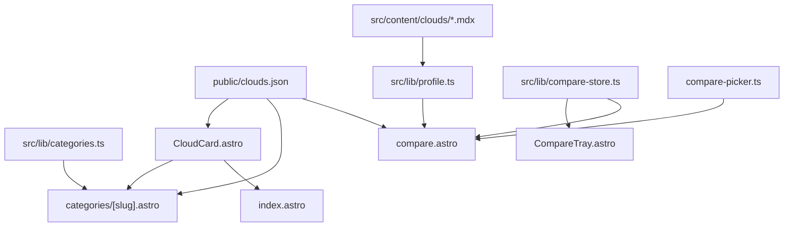

# Phase 4 — Comparison & Discovery Aids

> Status: **Implementation landed 2026-06-30**
> Branch: `feat/astro-migration`
> Tracks: [Issue #164](https://github.com/datum-cloud/awesome-alt-clouds/issues/164) Idea 3
> RFC: [2026-05-19-astro-migration-rfc.md](./2026-05-19-astro-migration-rfc.md)

## Overview

Extend discovery from ephemeral homepage filter state to **dedicated routes** and add **side-by-side compare**. Deliverables: category landing pages at `/categories/<slug>`, a `/compare` page with attribute table and shareable deep links, a versus.com-style **compare tray** (localStorage basket + floating button), and **type-to-search column pickers** on the compare page.

## Acceptance criteria (RFC Phase 4)

| Criterion | Status |
|---|---|
| `/categories/<slug>` for all 23 categories | ✅ |
| `/compare` with 2–3 cloud picker + attribute table | ✅ |
| Query-param deep links (`?a=&b=&c=`) | ✅ |
| Nav link from homepage sidebar / category pages | ✅ |
| Compare CTA on detail pages and cloud cards | ✅ |
| Versus-style compare tray (add → floating bar → compare) | ✅ |
| Searchable combobox pickers on compare page | ✅ |

## Architecture

## What landed

### Category landings

- [`src/pages/categories/[slug].astro`](../src/pages/categories/[slug].astro) — 23 static pages via `getStaticPaths`
- [`src/lib/categories.ts`](../src/lib/categories.ts) — SEO descriptions ported from `generate_llms.py:_CAT_DESCRIPTIONS`
- [`src/components/CloudCard.astro`](../src/components/CloudCard.astro) — shared card extracted from homepage
- `CollectionPage` + `ItemList` JSON-LD; `sitemap-categories-0.xml` chunk

### Compare page

- [`src/pages/compare.astro`](../src/pages/compare.astro) — merged cloud data, attribute table, URL/store sync
- [`src/components/CompareTable.astro`](../src/components/CompareTable.astro) — side-by-side rows from `clouds.json` + MDX frontmatter
- [`src/lib/compare.ts`](../src/lib/compare.ts) — row definitions and formatting
- [`src/components/CompareCloudPicker.astro`](../src/components/CompareCloudPicker.astro) + [`src/lib/compare-picker.ts`](../src/lib/compare-picker.ts) — type-to-search combobox per column (name + category filter, keyboard nav, duplicate guard across columns)

### Versus-style compare tray

- [`src/lib/compare-store.ts`](../src/lib/compare-store.ts) — `localStorage` basket (`aac:compare`), max 3, cross-tab sync
- [`src/components/CompareTray.astro`](../src/components/CompareTray.astro) — floating **Compare (n)** bar site-wide (via [`Base.astro`](../src/layouts/Base.astro))
- [`src/components/CompareButton.astro`](../src/components/CompareButton.astro) — toggle on detail sidebar
- **Compare +** on [`CloudCard.astro`](../src/components/CloudCard.astro) (compact corner control)
- [`CompareNavLink.astro`](../src/components/CompareNavLink.astro) — sidebar link on homepage and directory pages
- `/compare` disables tray (`showCompareTray={false}`); page hydrates from store when URL has no params

### Reserved routes

`categories` and `compare` added to `RESERVED_SLUGS` in [`src/lib/clouds.ts`](../src/lib/clouds.ts).

## Verification (2026-06-30)

- `npm run build` → 432 pages (23 category + `/compare` + existing routes)
- `npm run lint` — clean
- Manual: tray add/remove, `/compare?a=&b=&c=` deep links, picker search, Clear all

## Out of scope (RFC)

Full-text profile search, server-side saved comparisons, "similar providers", comparing >3 clouds, per-page OG images.

## File index

| Area | Key files |
|---|---|
| Categories | `src/lib/categories.ts`, `src/pages/categories/[slug].astro` |
| Compare page | `src/pages/compare.astro`, `src/lib/compare.ts`, `src/components/CompareTable.astro` |
| Search pickers | `src/components/CompareCloudPicker.astro`, `src/lib/compare-picker.ts` |
| Compare tray | `src/lib/compare-store.ts`, `src/components/CompareTray.astro`, `CompareButton.astro` |
| Shared UI | `src/components/CloudCard.astro`, `src/layouts/Base.astro` |
| SEO | `src/lib/sitemap-chunks.ts` (`categories` chunk) |
